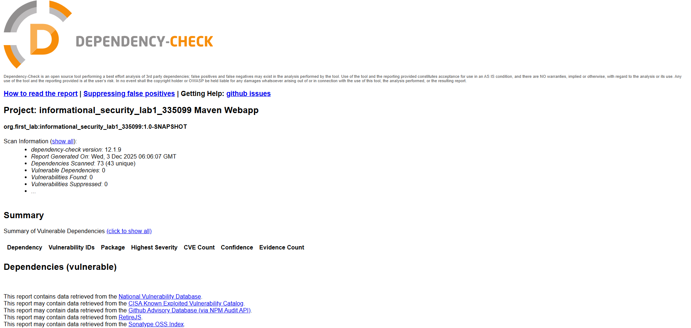
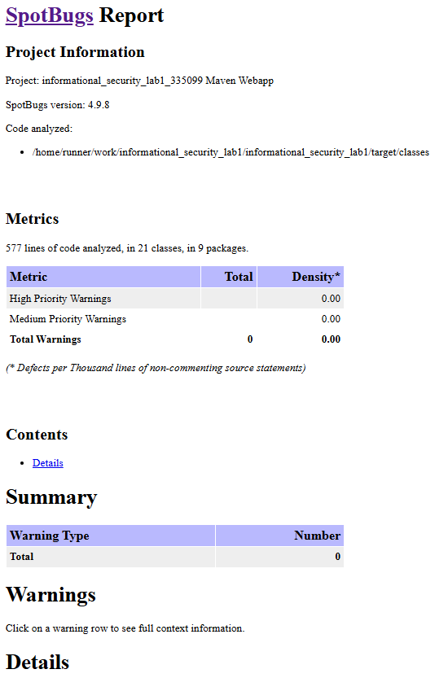

# Лабораторная работа: Разработка защищенного REST API для управления задачами

## Описание проекта

**Secure Task Manager API** — это веб-сервис для управления задачами с полным циклом аутентификации, авторизации и комплексной защитой от основных веб-угроз. Проект реализован в рамках учебного задания по информационной безопасности с использованием современных практик защиты веб-приложений.

> **Основная цель**: Демонстрация навыков создания безопасного API с интеграцией средств автоматизированной проверки безопасности в CI/CD.

## Технологический стек

| Компонент | Технология                   | Назначение |
|-----------|------------------------------|------------|
| **Бэкенд** | Java 21, Spring Boot 3.5.7   | Основной фреймворк |
| **Безопасность** | Spring Security, JWT (Auth0) | Аутентификация и авторизация |
| **База данных** | PostgreSQL, Spring Data JPA  | Хранение данных |
| **Валидация** | Bean Validation (jakarta)    | Проверка входных данных |
| **Документация** | SpringDoc OpenAPI            | Автогенерация API-документации |
| **Безопасность** | BCrypt (cost factor 10)      | Хэширование паролей |

## API Endpoints

### Аутентификация

#### POST `/api/authentication/signin`
**Аутентификация существующего пользователя.**

*Тело запроса:*
```json
{
  "login": "username",
  "password": "securePassword123"
}
```
*Успешный ответ (200):*

```json
{
"accessToken": "eyJhbGciOiJIUzI1NiIsInR5cCI6IkpXVCJ9...",
"tokenType": "Bearer",
"userLogin": "username",
"userFullName": "Пользователь username",
"expiresIn": 86400000
}
```

#### POST `/api/authentication/signup`
**Регистрация нового пользователя.**

*Тело запроса: (аналогично signin)*

*Успешный ответ (201 Created):*
```json
{
"accessToken": "eyJhbGciOiJIUzI1NiIsInR5cCI6IkpXVCJ9...",
"tokenType": "Bearer",
"userLogin": "newuser",
"userFullName": "Пользователь newuser",
"expiresIn": 86400000
}
```
*Ошибка (409 Conflict):*

```json
{
"type": "about:blank",
"title": "Конфликт данных",
"status": 409,
"detail": "Логин уже занят",
"instance": "/api/authentication/signup"
}
```

### Управление задачами (требует аутентификации)
Все эндпоинты ниже требуют заголовок:

```text
Authorization: Bearer <access-token>
```

#### POST `/api/tasks`
**Создание новой задачи.**

*Тело запроса:*

```json
{
"taskTitle": "Закончить лабораторную работу",
"taskDescription": "Необходимо завершить все разделы по безопасности",
"priority": "HIGH"
}
```

*Успешный ответ (201 Created):*

```json
{
"taskId": 1,
"taskTitle": "Закончить лабораторную работу",
"taskDescription": "Необходимо завершить все разделы по безопасности",
"isCompleted": false,
"priority": "HIGH",
"createdAt": "2025-12-03T10:30:00",
"dueDate": null,
"assignedUserLogin": "username",
"assignedUserFullName": "Пользователь username"
}
```
#### GET `/api/tasks`
**Получение списка всех задач текущего пользователя.**

*Ответ (200 OK):*

```json
[
{
"taskId": 1,
"taskTitle": "Закончить лабораторную работу",
"taskDescription": "Необходимо завершить все разделы по безопасности",
"isCompleted": false,
"priority": "HIGH",
"createdAt": "2025-12-03T10:30:00",
"dueDate": null,
"assignedUserLogin": "username",
"assignedUserFullName": "Пользователь username"
}
]
```
#### GET `/api/tasks/search`
**Поиск задач с фильтрацией.**

*Тело запроса:*

```json
{
"searchQuery": "лабораторная",
"completedStatus": false,
"priorityFilter": "HIGH"
}
```
*Ответ: Аналогично `GET /api/tasks`*

#### PUT `/api/tasks/{taskId}/complete`
**Отметка задачи как выполненной.**

*Параметр пути:* `taskId` (числовой ID задачи)

*Успешный ответ (200 OK):*

```json
{
"taskId": 1,
"taskTitle": "Закончить лабораторную работу",
"taskDescription": "Необходимо завершить все разделы по безопасности",
"isCompleted": true,  // Изменено на true
"priority": "HIGH",
"createdAt": "2025-12-03T10:30:00", 
"dueDate": null,
"assignedUserLogin": "username",
"assignedUserFullName": "Пользователь username"
}
```
*Ошибка доступа (если задача не принадлежит пользователю):*

```json
{
"type": "about:blank",
"title": "Internal Server Error",
"status": 500,
"detail": "Нет доступа к задаче"
}
```

## Реализованные меры безопасности

### Уровень 1: Защита данных и доступа

#### 1.1 Защита от SQL-инъекций (SQL Injection)
 + **Spring Data JPA** с параметризованными запросами
 + Использование `@Query` с именованными параметрами для безопасного поиска:
```java
@Query("""
        SELECT t FROM Task t
        WHERE LOWER(t.taskTitle) LIKE LOWER(CONCAT('%', :searchText, '%'))
           OR LOWER(t.taskDescription) LIKE LOWER(CONCAT('%', :searchText, '%'))
        """)
List<Task> findTasksByText(@Param("searchText") String searchText);
```
+ Автоматическое экранирование через JPA
+ Отказ от нативных SQL-запросов в пользу репозиториев Spring Data

#### 1.2 Защита от XSS (Cross-Site Scripting)
 + **Кастомный JSON сериализатор** `XssProtectionSerializer` для автоматического экранирования:

```java
public class XssProtectionSerializer extends JsonSerializer<String> {
@Override
public void serialize(String value, JsonGenerator gen, SerializerProvider providers) throws IOException {
String sanitizedValue = value
.replace("&", "&amp;")
.replace("<", "&lt;")
.replace(">", "&gt;")
.replace("\"", "&quot;")
.replace("'", "&#x27;")
.replace("/", "&#x2F;");
gen.writeString(sanitizedValue);
}
}
```
 + Применяется ко всем строковым полям в JSON-ответах автоматически

#### 1.3 Валидация входных данных
 + Bean Validation с аннотациями:

```java
@NotBlank(message = "Название задачи обязательно")
@Size(min = 3, max = 200, message = "Название задачи должно содержать от 3 до 200 символов")
private String taskTitle;
```

### Уровень 2: Безопасная аутентификация
#### 2.1 JWT-токены
 + **Auth0 JWT библиотека** для генерации и валидации токенов

 + Алгоритм HMAC-SHA256 с секретным ключом

 + Время жизни токена: 24 часа

 + Проверка подписи и срока действия в каждом запросе

#### 2.2 Хэширование паролей
 + **BCrypt** с cost factor 10 для оптимального баланса безопасности и производительности:

```java
@Bean
public PasswordEncoder passwordEncoder() {
return new BCryptPasswordEncoder(10);
}
```
 + Соль генерируется автоматически для каждого пароля

 + Пароли никогда не хранятся в открытом виде

#### 2.3 Защита эндпоинтов
 + Разделение маршрутов на публичные и защищенные:

```java
.requestMatchers("/api/authentication/**", "/api-documentation/**", "/openapi/**", "/system/status", "/error").permitAll()
.requestMatchers("/api/tasks/**").authenticated()
.anyRequest().denyAll()  // Глобальный deny по умолчанию
```
 + `JwtAuthenticationFilter` проверяет токены на защищенных маршрутах

### CI/CD Pipeline с Security Scanning
#### Структура пайплайна
```text
GitHub Actions Workflow (.github/workflows/ci.yml)
├── Job 1: Build (Сборка проекта)
├── Job 2: Dependency Check (Проверка уязвимостей)
└── Job 3: SpotBugs (Статический анализ кода)
```

### Используемые инструменты безопасности
#### SAST (Static Application Security Testing)
 + **SpotBugs** версия 4.9.8.2

 + Проверка на:

    + Null pointer dereferences
    + Утечки ресурсов

    + Популярные проблемы безопасности

    + Плохие практики кода

#### SCA (Software Composition Analysis)
 + **OWASP Dependency-Check** версия 12.1.9

 + Автоматическое сканирование зависимостей Maven

 + Проверка против базы уязвимостей NVD

 + Генерация отчетов в форматах HTML и XML

### Отчет OWASP Dependency-Check

*Полное отсутствие уязвимостей в зависимостях проекта*

### SpotBugs Report

*Статический анализ не выявил критических проблем в коде*